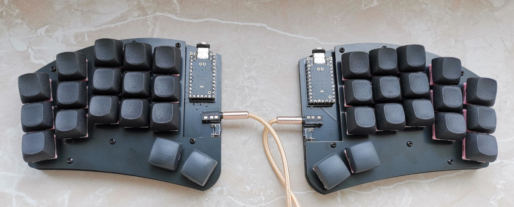

# swepp

## Attention

I'm a hobbyist/amateur at best. So there may be things that aren't optimized. That being said I've had the files
in the `gerbers/` directory manufactured at JLC with 1.6mm thickness and they work just fine with my fork of the qmk repository
directory. So if you decide to use this, then please be advised that I'm not providing any sort of liability and you should
exercise some caution.

## Case

There are three options for the case: The first one is a simple FR4 stack. You'll need some M2 spacers and screws to fix it all
together. Plates and bottoms are reversible. The second option is a simple tray case. You'll need M2 heat inserts and screws to
fix the plate to the bottom. If you don't like the 3d printed plate you can also use the FR4 plate with spacers in this case.
The final option is a massive gasket mounted case that hides the switches.

## BOM

| Quantity   | Item                               | Comment                       |
| ---------  | ---------------------------------- | ----------------------------- |
| 2          | Helios or Liatris Controller       |                               |
| 2          | IC-Sockets+Pins for MCU            | Optional but recommended      |
| 2          | TRRS Sockets                       |                               |
| 2          | SKHLLBA010 buttons                 |                               |
| 34         | MX Hotswap Sockets                 |                               |
| 34         | MX Switches + Keycaps              |                               |
| 12         | M2 Screws                          | (countersunk for gasket case) |
| 12         | M2 heat inserts                    | Only for the 3d printed cases |

## Firmware

See [my fork](https://github.com/sebastian-stumpf/qmk_firmware/tree/sepp/keyboards/swepp) of the qmk repository. Nothing special here.
You can just copy the code over to your own repository and adjust the keymap.

## Feedback

I'm always happy to hear your opinions about this and if you decide to build this board then please do send me a picture of it.
